# coil-transformations

Image transformations for Coil.

## Download

Add this in your root `build.gradle` file (**not** your module `build.gradle` file):

```gradle
allprojects {
	repositories {
		...
		maven { url "https://jitpack.io" }
	}
}
```
Then, add the library to your app `build.gradle`
```kotlin
implementation("com.github.Commit451.coil-transformations:transformations:latest.version.here")
```
and for GPU (native) transformations (relies on [GPUImage](https://github.com/cats-oss/android-gpuimage)):
```kotlin
implementation("com.github.Commit451.coil-transformations:transformations-gpu:latest.version.here")
```

## Supported Transformations

These transformations are already supported in Coil itself (no need for this library):
- BlurTransformation
- CircleCropTransformation
- GrayscaleTransformation
- RoundedCornersTransformation

From the base library (`transformations`):
- ColorFilterTransformation
- CropTransformation (top, center, bottom)
- MaskTransformation
- SquareCropTransformation

From the GPU library (`transformations-gpu`)
- BrightnessFilterTransformation
- ContrastFilterTransformation
- InvertFilterTransformation
- KuwaharaFilterTransformation
- PixelationFilterTransformation
- SepiaFilterTransformation
- SketchFilterTransformation
- SwirlFilterTransformation
- ToonFilterTransformation
- VignetteFilterTransformation

## Quick Start

To load an image into an `ImageView` with transformations, use the `load` extension function:
```kotlin
imageView.load("https://www.example.com/image.jpg") {
    transformations(BlurTransformation(), CircleCropTransformation()) // You can add as many as desired
}
```

## Preview
Here, you can preview each of the type of filters.

### `com.github.Commit451.coil-transformations:transformations`
- ColorFilterTransformation

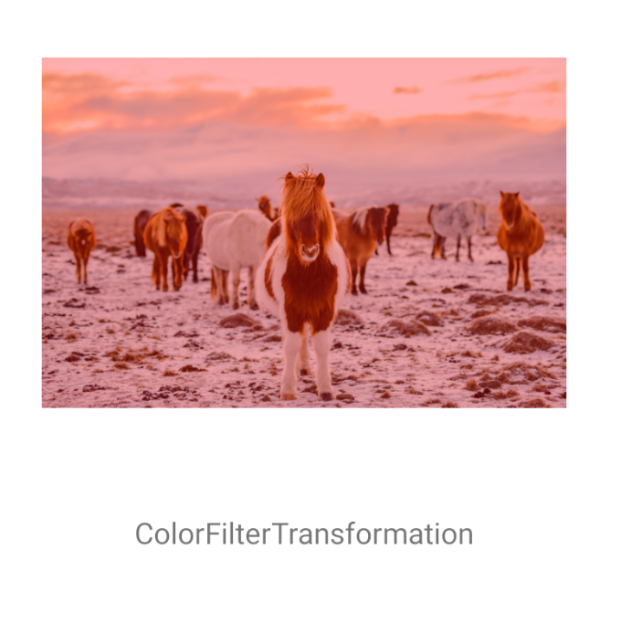

- CropTransformation

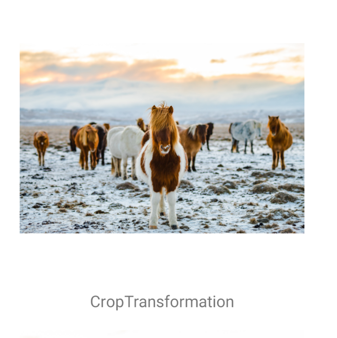

- MaskTransformation

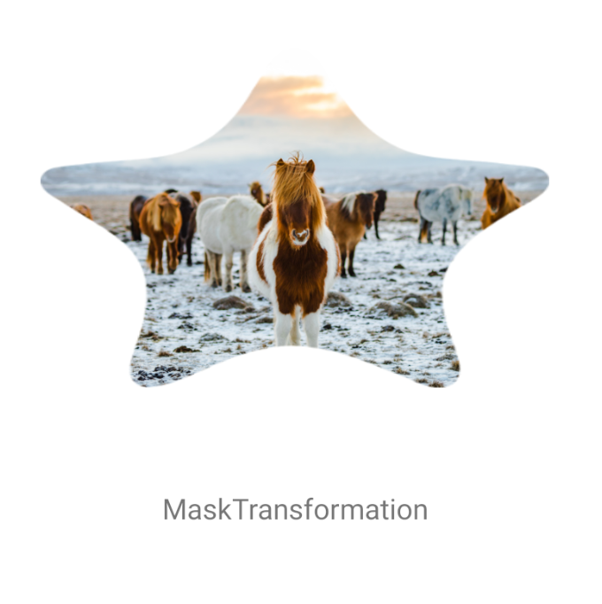

- SquareCropTransformation

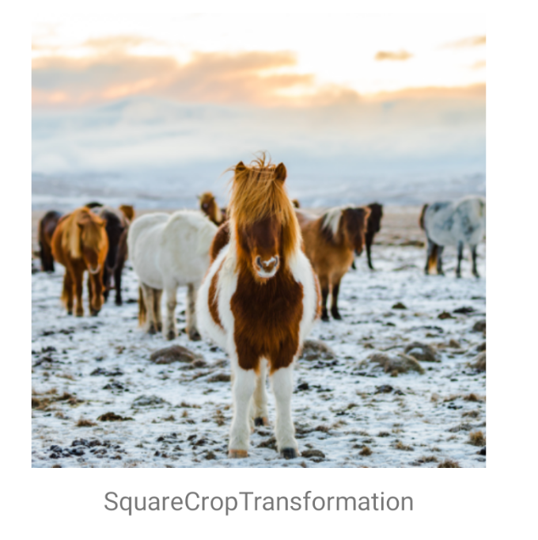

### `com.github.Commit451.coil-transformations:transformations-gpu`

- BrightnessFilterTransformation

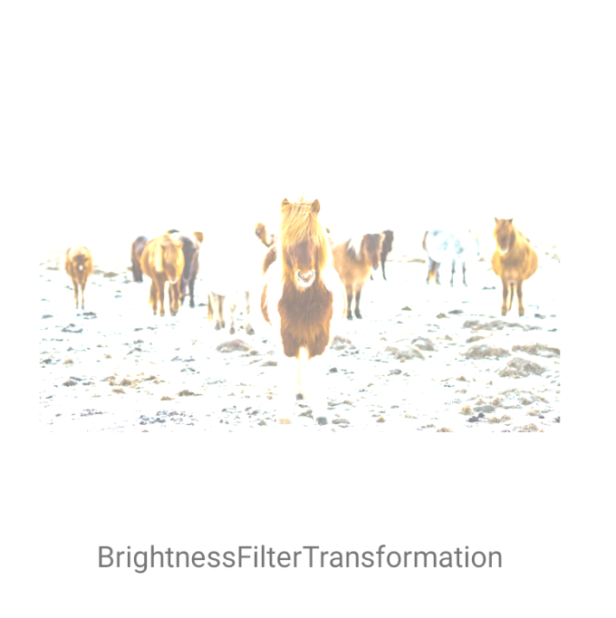

- ContrastFilterTransformation

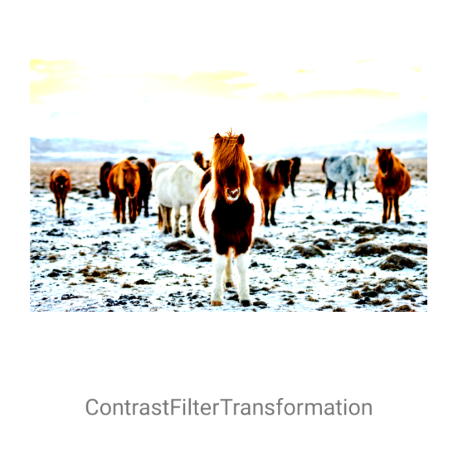

- InvertFilterTransformation

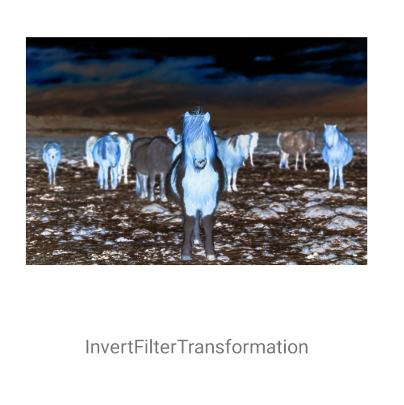

- KuwaharaFilterTransformation

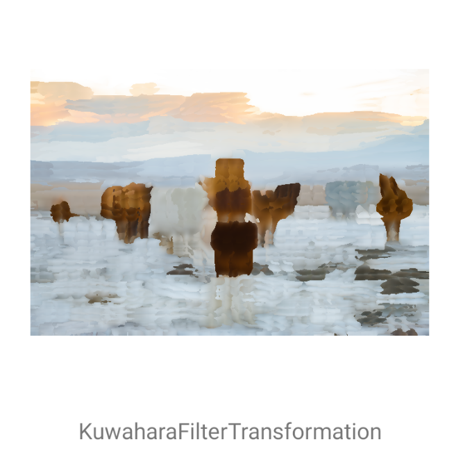

- PixelationFilterTransformation

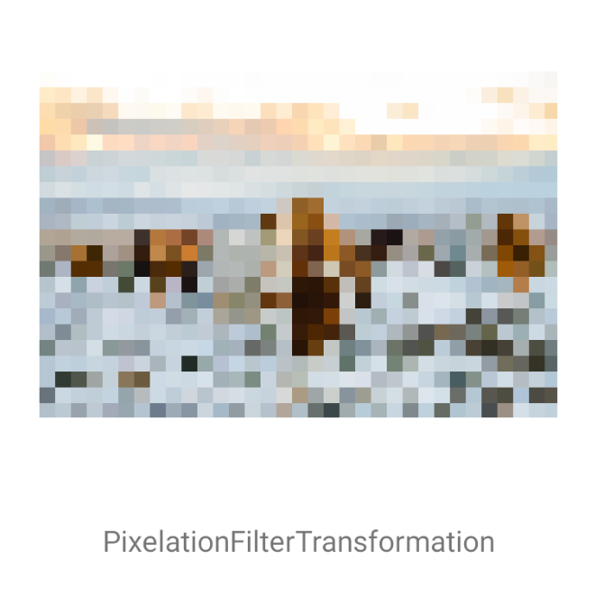

- SepiaFilterTransformation

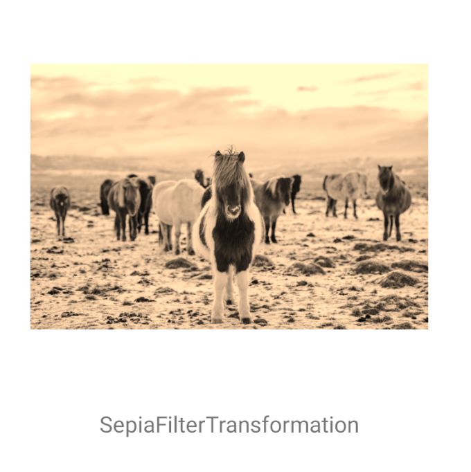

- SketchFilterTransformation

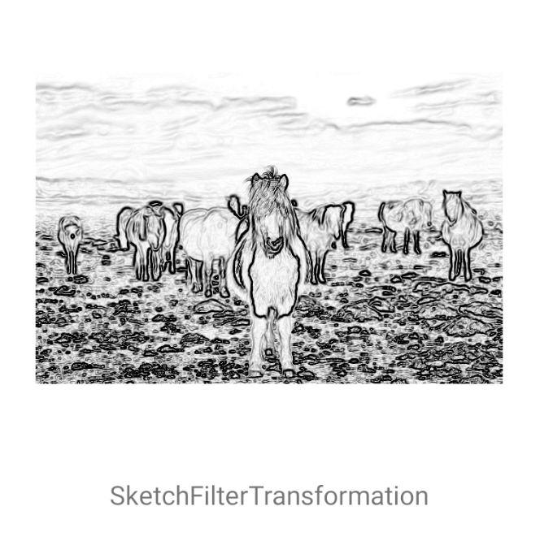

- SwirlFilterTransformation

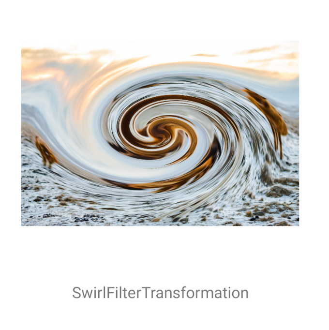

- ToonFilterTransformation

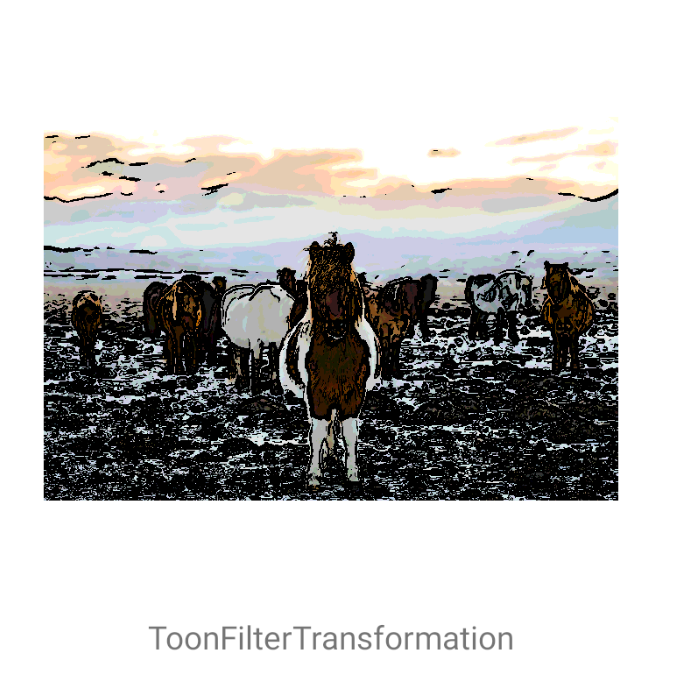

- VignetteFilterTransformation

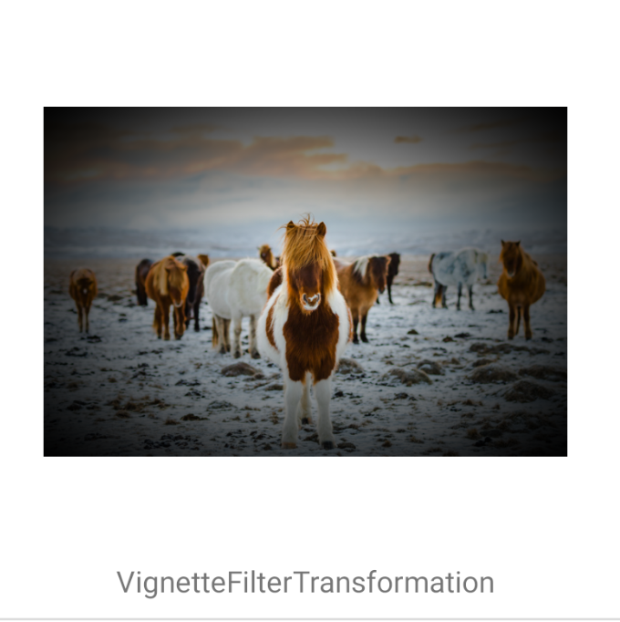

## Thanks
Inspired by [Glide Transformations](https://github.com/wasabeef/glide-transformations) by [wasabeef](https://github.com/wasabeef)

## License

    Copyright 2019 Commit 451

    Licensed under the Apache License, Version 2.0 (the "License");
    you may not use this file except in compliance with the License.
    You may obtain a copy of the License at

       https://www.apache.org/licenses/LICENSE-2.0

    Unless required by applicable law or agreed to in writing, software
    distributed under the License is distributed on an "AS IS" BASIS,
    WITHOUT WARRANTIES OR CONDITIONS OF ANY KIND, either express or implied.
    See the License for the specific language governing permissions and
    limitations under the License.
