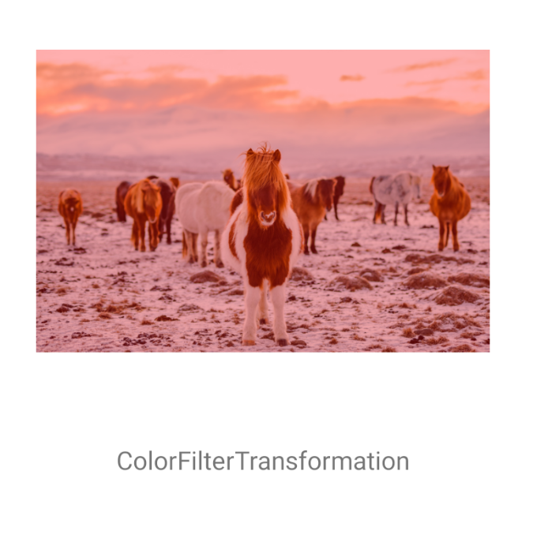
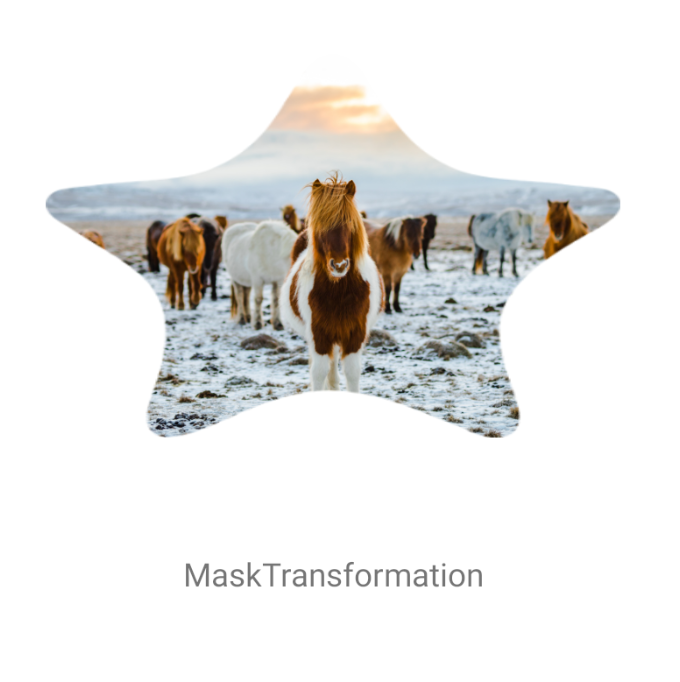
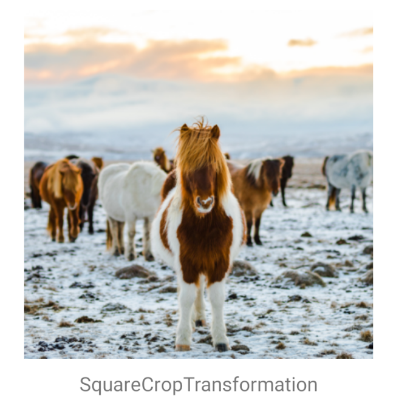
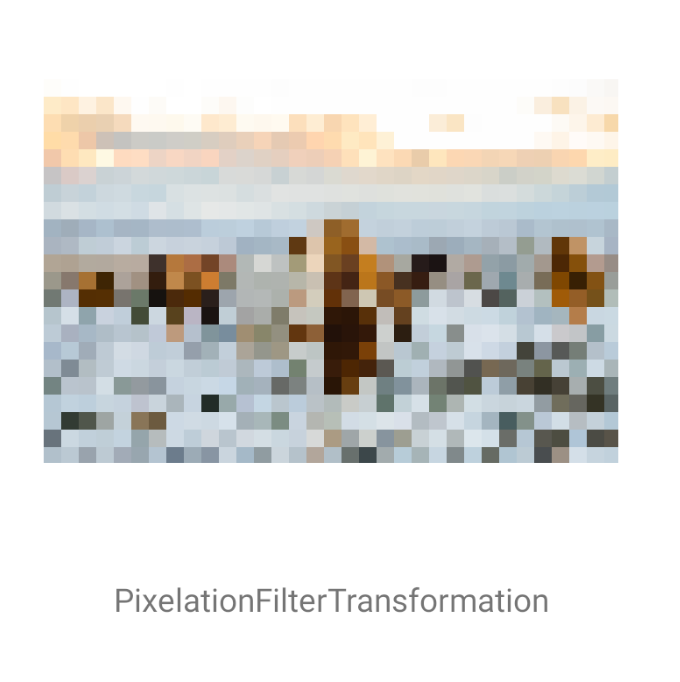
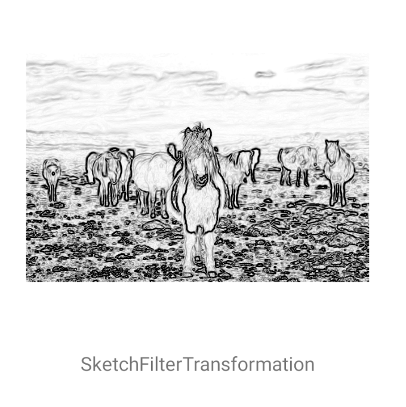
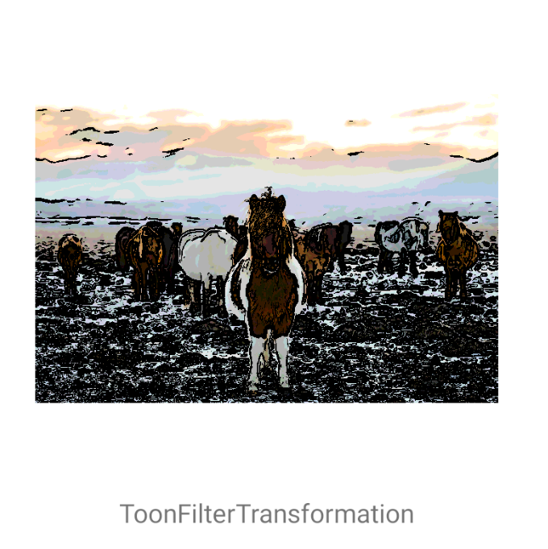
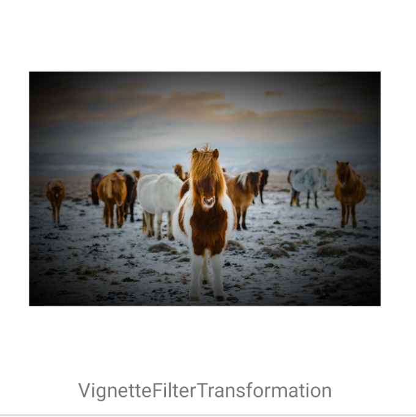

Here, you can preview each of the type of filters.

### `com.github.Commit451.coil-transformations:transformations`
- ColorFilterTransformation

- CropTransformation

- MaskTransformation

- SquareCropTransformation

### `com.github.Commit451.coil-transformations:transformations-gpu`

- BrightnessFilterTransformation

- ContrastFilterTransformation

- InvertFilterTransformation

- KuwaharaFilterTransformation

- PixelationFilterTransformation

- SepiaFilterTransformation

- SketchFilterTransformation

- SwirlFilterTransformation

- ToonFilterTransformation

- VignetteFilterTransformation

### `com.github.Commit451.coil-transformations:transformations-face-detection`

- CenterOnFaceTransformation

